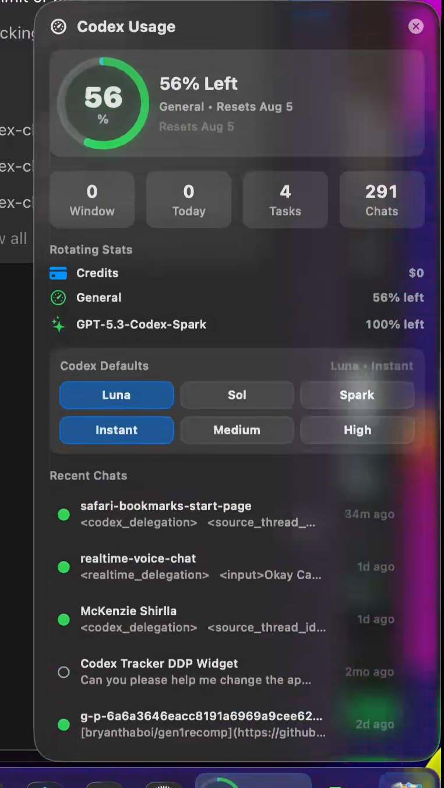
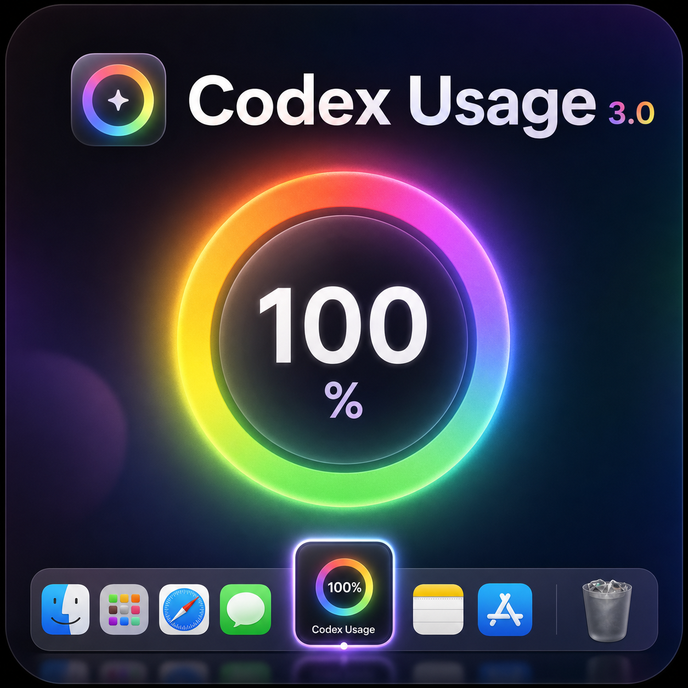

# Codex Usage for DockDoor Pro

A lightweight DockDoor Pro widget for keeping Codex usage, credit balance, recent chats, project activity, and local Codex defaults visible from the dock.

**Current release:** `3.0.0`



## Social Preview

Use this square cover image as the first Discord attachment when announcing the widget:



## Highlights

- Usage countdown ring in the dock, with a built-in rainbow ring toggle.
- Rotating dock cards for account limits, selected model, task count, and chat count.
- Panel view with credits, general usage, model-specific limits, task/chat totals, and recent Codex sessions.
- Clickable recent chats that open Codex tasks through `codex://threads/<session-id>` when a session id is available.
- Local model and reasoning default controls for Luna, Sol, Spark, Instant, Medium, and High.
- DockDoor settings schema for session folder, usage state file, recent session count, budget window, and rainbow mode.

## Lightweight Design

Codex Usage is intentionally thin. It reads local Codex state directly, renders with native SwiftUI, avoids background helper processes, and refreshes small snapshots on a modest interval. The dock stays responsive without constantly polling or doing heavy work in the background.

The compact dock card rotates every few seconds, session/usage snapshots refresh periodically, and the expanded panel uses a slower label refresh because the data does not require second-by-second updates. That keeps the widget visually alive while staying low on energy and memory use.

## Important Boundary

The model and reasoning buttons update local Codex defaults in `~/.codex/config.toml`. They apply to new local Codex work after the setting changes. They do not hot-swap the model or reasoning level of an already-running chat.

## Runtime Data

The widget reads Codex session files from `~/.codex/sessions` by default. Current Codex builds include authoritative account `rate_limits` snapshots in those session events, so the widget uses the newest General and model-specific limits directly. It reads `~/.codex/usage.json` only as a compatibility fallback for older Codex builds, then falls back to local token-window estimates if neither account source is available.

See [examples/usage.json](examples/usage.json) for the account-usage shape used by the current build.

## Settings

DockDoor Pro exposes these widget settings:

| Setting | Default | Purpose |
| --- | --- | --- |
| Codex Sessions Folder | `~/.codex/sessions` | Where recent Codex task/session JSONL files are scanned. |
| Recent Session Count | `5` | Number of recent chats shown in the panel. |
| Usage Budget (M tokens) | `200` | Fallback rolling-window budget when account usage data is unavailable. |
| Usage Window Hours | `5` | Fallback rolling-window length. |
| Usage State File | `~/.codex/usage.json` | Optional compatibility fallback when live session rate limits are unavailable. |
| Rainbow Usage Ring | `On` | Uses the rainbow/glow usage ring instead of a single-color ring. |

The panel also includes a small palette button in the header. That button toggles the same `Rainbow Usage Ring` preference without needing to open DockDoor Pro settings.

## Build

From this folder:

```bash
bash Scripts/build-widgets.sh Widgets/CodexProjectTracker
```

Build output:

```text
Build/CodexProjectTracker.bundle
Build/CodexProjectTracker.bundle.zip
```

## Install Locally

Copy the built bundle into DockDoor Pro's widget folder:

```bash
mkdir -p "$HOME/Library/Application Support/DockDoorPro/Widgets"
cp -R Build/CodexProjectTracker.bundle "$HOME/Library/Application Support/DockDoorPro/Widgets/"
```

Restart DockDoor Pro after replacing an installed bundle.

## Marketplace Prep

This folder is structured so it can become a standalone GitHub repo before submitting a marketplace PR to `ejbills/dockdoorpro-widgets`.

Before opening the marketplace PR:

- Confirm the widget builds with the current DockDoor Pro widget SDK.
- Confirm the screenshot in `screenshots/codex-usage-panel.png` matches the current UI.
- Confirm `widget.json` uses the marketplace-ready name, description, icon, and principal class.
- Add any new real-world screenshots to `screenshots/`.
- Use [docs/MARKETPLACE_SUBMISSION.md](docs/MARKETPLACE_SUBMISSION.md) as the submission checklist.
